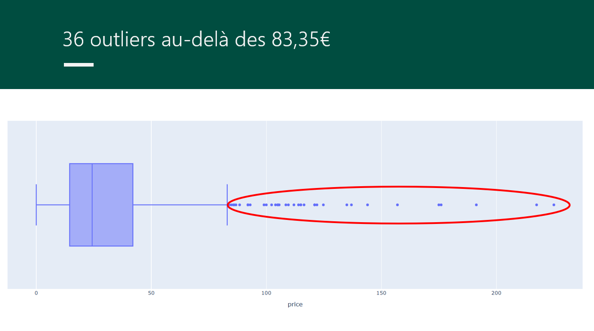
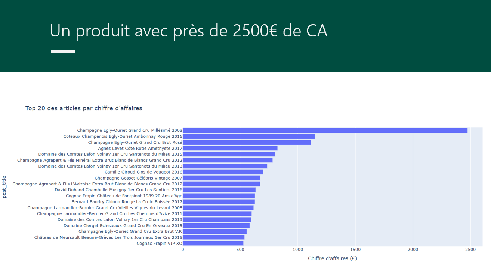
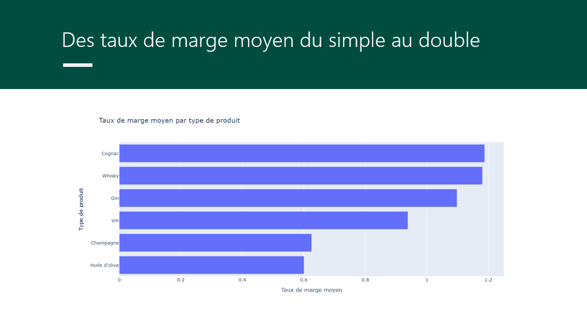
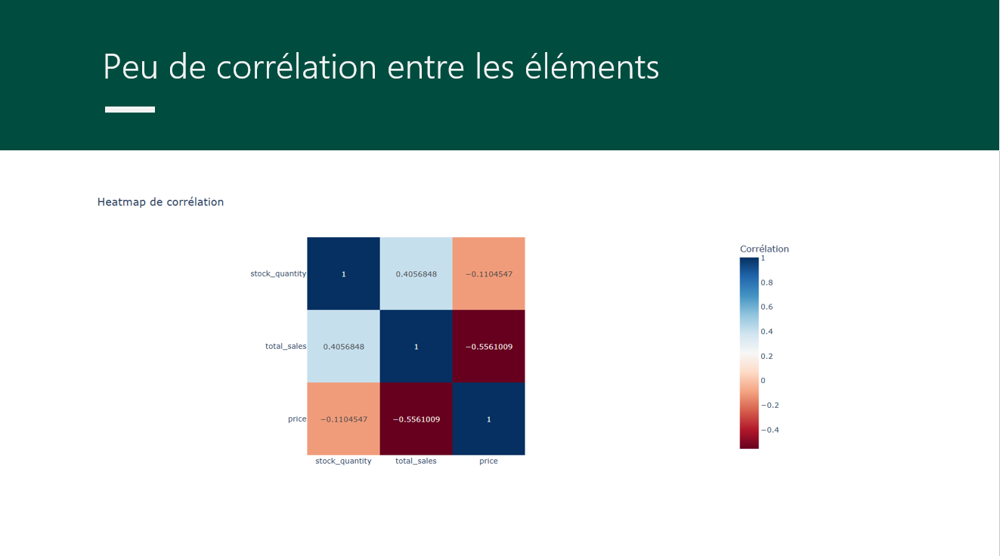

# Projet 6 – Optimisez la gestion des données d'une boutique avec Python

## Contexte du projet

Ce projet a été réalisé dans le cadre d’une mission de **Data Analyst** pour l’entreprise **BottleNeck**, un marchand de vins prestigieux.  

L’objectif était de répondre à différentes **questions commerciales** afin d’aider à la **prise de décision** et à la mise en place d’actions concrètes, en s’appuyant sur les données disponibles relatives au **chiffre d’affaires**, aux **stocks** et aux **ventes**.

---

## Objectifs pédagogiques

- Réaliser des analyses **univariées** et **multivariées** sur des données pré-traitées  
- Pré-traiter les données afin d’explorer et de comprendre leurs caractéristiques  
- Nettoyer et traiter les données, et définir la gestion des incohérences en conformité avec le **RGPD**

---

## Outils utilisés

- **Python**

---

## Résultats du projet

Le projet débute par un travail approfondi sur la **qualité des données**, comprenant plusieurs étapes clés :

- Prise de connaissance des données issues de **trois sources distinctes**
- Analyses exploratoires de chaque table afin d’identifier les types de données
- Gestion des incohérences :  
  - présence de doublons  
  - colonnes mal renseignées  
  - valeurs négatives incohérentes
- Fusion des différentes tables de données

Une fois les données nettoyées, des **analyses statistiques et graphiques** ont été réalisées afin de faire émerger des **insights utiles** pour la prise de décision.

### Principaux enseignements

- La visualisation des prix des produits à l’aide d’une **boîte à moustaches** a permis d’identifier **36 produits aux prix particulièrement élevés**.  
  Ces valeurs atypiques sont cohérentes car il s’agit de **grands crus millésimés**.  
  L’identification de ces *outliers* permet de les isoler afin de ne pas biaiser les calculs et analyses.

- Un **graphique en barres** représentant le **top 20 des articles par chiffre d’affaires** met en évidence que le produit numéro 1 est également celui ayant la **rotation de stock la plus longue**, avec **275 jours de stockage**, soit plus de 9 mois.

- Un autre graphique en barres permet d’analyser le **taux de marge moyen par type de produit**.  
  Les taux de marge varient entre **60 % et 120 %**.  
  Le produit présentant le taux de marge moyen le plus élevé est le **cognac**, tandis que celui ayant le taux le plus faible est **l’huile d’olive**.

- La **corrélation entre les différents indicateurs** est représentée à l’aide d’un **heatmap**.  
  Cette analyse montre notamment que :
  - plus un produit est vendu, plus son stock diminue
  - le prix et le nombre de produits vendus ne sont pas corrélés

### Recommandations

L’objectif final de ces analyses est de permettre la mise en place d’actions concrètes :

- Statuer sur les problèmes d’incohérences dans les données et mettre en place des **processus décisionnels de gestion des données**
- Revoir la **rotation** et la **valorisation des stocks**, car un produit immobilisé en stock ne génère pas de chiffre d’affaires et engendre des coûts

---

## Compétences acquises

- Maîtrise des étapes de **nettoyage et de préparation des données**
- Utilisation de **Python** pour des analyses statistiques et la création de visualisations
- Utilisation de la **courbe de Lorenz** et de l’**indice de Gini**

---

## Illustrations

### Détection des valeurs atypiques

### Top 20 des articles par chiffre d'affaires

### Taux de marge moyen par type de produit

### Corrélation entre les indicateurs

